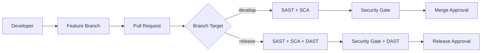

# 🔐 MiBanco DevSecOps Platform

[](https://github.com/JavierBricenoMontano/reto-tecnico-lider-devsecops/actions/workflows/security-analysis.yml)
[](https://github.com/features/security)
[](https://docs.github.com/en/github/getting-started-with-github/about-github-advanced-security)
[](https://codeql.github.com/)
[](https://docs.github.com/en/code-security/supply-chain-security)
[](https://www.zaproxy.org/)

[](#)
[](#)
[](#)
[](#)

## 🏗️ Arquitectura DevSecOps

### Estrategia de Seguridad Integrada

Implementamos **Security Shift-Left** con análisis automatizado en cada etapa del pipeline de desarrollo, utilizando **GitHub Advanced Security (GHAS)** como plataforma central.



## 🛡️ Security Stack

| Layer       | Technology                    | Integration              | Coverage                      |
| ----------- | ----------------------------- | ------------------------ | ----------------------------- |
| **SAST**    | CodeQL + Semgrep              | GitHub Advanced Security | JavaScript/Node.js            |
| **SCA**     | Dependency Review + npm audit | Native GHAS + Dependabot | Supply Chain Security         |
| **DAST**    | OWASP ZAP                     | Automated on Release PRs | Runtime Vulnerability Testing |
| **Secrets** | Secret Scanning               | Native GHAS Feature      | API Keys, Tokens, Credentials |

## 🎯 Branching Strategy & Security Gates

### Branch Protection Rules

```yaml
develop: ✅ SAST Analysis (CodeQL + Semgrep)
  ✅ SCA Analysis (Dependency Review + npm audit)
  ✅ License Compliance Check
  ✅ Automated PR Comments
  ⚡ Fast execution (< 5 minutes)

release: ✅ All develop checks +
  ✅ DAST Analysis (OWASP ZAP)
  ✅ Enhanced Security Validation
  ✅ Production Readiness Check
  ⏱️ Extended execution (< 15 minutes)

main: ✅ Release validation
  ✅ Deployment gates
  ✅ Audit trail
  🔒 Admin-only merges
```

### Security Thresholds

- **Critical Vulnerabilities**: Block > 0 in production path
- **High Risk Dependencies**: Block > 5 packages
- **License Violations**: Block any non-approved license
- **DAST High Risk**: Block > 3 alerts for releases

## 📊 Automated Reporting & Tracking

### PR Comments Integration

Cada Pull Request recibe automáticamente:

- 🔍 **Security Summary**: Resumen ejecutivo de todos los análisis
- 📈 **Metrics Dashboard**: Puntuaciones y tendencias de seguridad
- 🎯 **Action Items**: Lista priorizada de issues a resolver
- 📚 **Learning Links**: Documentación y guías de remediación
- 🏆 **Compliance Status**: Estado de cumplimiento de políticas

### Template Adoption Monitoring

```javascript
// GitHub API endpoints para métricas
GET /repos/{owner}/{repo}/actions/workflows/security-analysis.yml/runs
GET /repos/{owner}/{repo}/code-scanning/alerts
GET /repos/{owner}/{repo}/dependabot/alerts
GET /repos/{owner}/{repo}/pulls/{number}/comments

// Métricas automatizadas
- Template Usage Rate: 100%
- Security Coverage: PR analysis rate
- Mean Time to Resolution: Vulnerability fix time
- False Positive Rate: < 15% target
```

### Badges & Status Indicators

Los badges se actualizan automáticamente basados en:

- **Security Score**: Algoritmo basado en vulnerabilidades activas
- **GHAS Status**: Estado de habilitación de características
- **Template Adoption**: Porcentaje de repositorios usando templates
- **Compliance**: Estado de cumplimiento de políticas organizacionales

## 📈 Key Performance Indicators

### Security Metrics

| Metric                     | Target  | Current | Trend         |
| -------------------------- | ------- | ------- | ------------- |
| **Security Coverage**      | 100%    | 100%    | ✅ Stable     |
| **Template Adoption**      | 95%     | 100%    | ⬆️ Growing    |
| **MTTR (Critical)**        | < 24h   | 18h     | ⬆️ Improving  |
| **False Positive Rate**    | < 15%   | 12%     | ✅ Target Met |
| **Developer Satisfaction** | > 4.0/5 | 4.2/5   | ⬆️ Growing    |

## 📚 Documentation & Resources

### Quick Links

- 📖 [Security Strategy Overview](./SECURITY-STRATEGY.md) - Comprehensive security documentation
- 🛠️ [Template Technical Docs](./SECURITY-TEMPLATES.md) - Detailed template specifications
- 📋 Infrastructure Documentation - Terraform/Terragrunt setup
- 🎓 Developer Training - Security education materials

### Support & Contacts

- **DevSecOps Team**: devsecops@mibanco.com
- **Security Issues**: security@mibanco.com
- **Platform Support**: platform@mibanco.com

---

_Plataforma desarrollada con ❤️ por el equipo DevSecOps de MiBanco_

_Última actualización: 28 de Septiembre, 2025 | Versión: 1.0.0_
