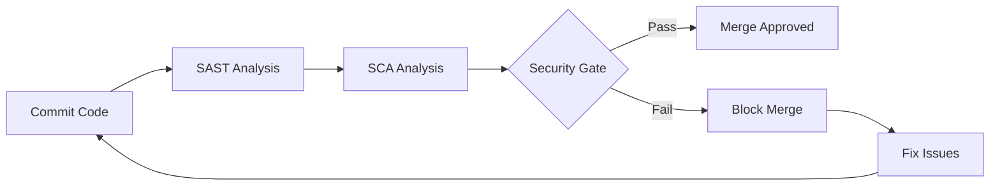
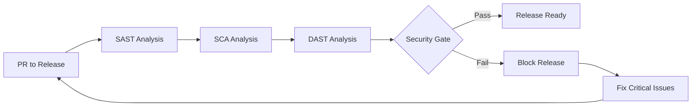

# 🔐 Estrategia de Seguridad DevSecOps - MiBanco

[](https://github.com/features/security)
[](https://codeql.github.com/)
[](https://docs.github.com/en/code-security/supply-chain-security)
[](https://www.zaproxy.org/)

## 📋 Resumen Ejecutivo

Este documento describe la implementación completa de una estrategia DevSecOps integrada que utiliza **GitHub Advanced Security (GHAS)** como plataforma central para el análisis de seguridad automatizado en el pipeline de CI/CD.

## 🏗️ Arquitectura de Seguridad

### Estrategia de Branching

```
main (producción)
├── release (pre-producción) ← SAST + SCA + DAST
└── develop (desarrollo) ← SAST + SCA
    └── feature/* (funcionalidades) ← SAST + SCA
```

### Análisis de Seguridad por Rama

- **develop → feature**: SAST + SCA (análisis básico)
- **develop → release**: SAST + SCA + **DAST** (análisis completo)
- **release → main**: Validación final automática

## 🛡️ Tipos de Análisis Implementados

### 1. Static Application Security Testing (SAST)

- **Herramienta Principal**: CodeQL (GitHub Advanced Security)
- **Herramienta Complementaria**: Semgrep con reglas OWASP Top 10
- **Lenguaje**: JavaScript/Node.js optimizado
- **Integración**: Resultados en SARIF format → GHAS Security tab

### 2. Software Composition Analysis (SCA)

- **Herramienta Principal**: GitHub Dependency Review
- **Herramienta Complementaria**: npm audit
- **Funcionalidades**:
  - Detección de vulnerabilidades en dependencias
  - Análisis de licencias (whitelist approach)
  - Alertas de dependencias obsoletas
- **Política de Licencias**: MIT, Apache-2.0, BSD, ISC permitidas

### 3. Dynamic Application Security Testing (DAST)

- **Herramienta**: OWASP ZAP
- **Activación**: Solo en PRs hacia branch `release`
- **Target**: http://74.179.229.101/ (configurable)
- **Tipos de Scan**: Baseline, Full, API
- **Integración**: Resultados automáticos en PR comments

## 🎯 Security Gates y Umbrales

### SAST Security Gate

```yaml
Criterios:
  - Análisis exitoso requerido
  - Resultados informativos (no bloquean)
  - Upload automático a GHAS
```

### SCA Security Gate

```yaml
Criterios de Bloqueo:
- Vulnerabilidades críticas: > 5 dependencias
- Licencias no permitidas: Cualquier violación
- Dependencias desactualizadas: > 10 major versions
```

### DAST Security Gate

```yaml
Criterios de Bloqueo:
- Vulnerabilidades altas: > 3 alertas
- Vulnerabilidades medias: Informativo
- Alertas informativas: Permitidas
```

## 📊 Implementación Técnica

### GitHub Advanced Security (GHAS) - Componentes Utilizados

#### 1. CodeQL Analysis

- **Configuración**: Automática para JavaScript
- **Frecuencia**: Cada PR + Push a ramas principales
- **Resultados**: GitHub Security → Code scanning alerts

#### 2. Dependency Graph & Review

- **Configuración**: Habilitada a nivel de repositorio
- **Alertas**: Dependabot security updates
- **Review**: Análisis automático en PRs

#### 3. Secret Scanning

- **Configuración**: Automática (GHAS feature)
- **Scope**: API keys, tokens, credenciales
- **Acción**: Bloqueo automático + notificaciones

### Templates de Seguridad Reutilizables

#### 1. security-sast-template.yml

```yaml
Funcionalidades:
  - CodeQL analysis optimizado para JavaScript
  - Semgrep con reglas OWASP Top 10
  - Generación de métricas de seguridad
  - Upload SARIF a GHAS
```

#### 2. security-sca-template.yml

```yaml
Funcionalidades:
  - GitHub Dependency Review integration
  - npm audit execution
  - License compliance checking
  - Vulnerability counting y reporting
```

#### 3. security-dast-template.yml

```yaml
Funcionalidades:
  - OWASP ZAP baseline/full/API scans
  - Target URL configurable
  - Automated reporting
  - Security gate validation
```

## 🤖 Automatización y Seguimiento

### PR Comments Automáticos

- **Resumen de seguridad**: Automático en cada PR
- **Alertas críticas**: Destacadas con emojis y colores
- **Links directos**: Acceso a GHAS Security tab
- **Recomendaciones**: Acciones específicas para remediation

### Badges de Estado

```markdown
[](#)
[](#)
[](#)
[](#)
```

### APIs de Seguimiento y Adopción

#### GitHub API Integration

```javascript
// Métricas de adopción de templates
GET / repos / { owner } / { repo } / actions / workflows;
GET / repos / { owner } / { repo } / security - advisories;
GET / repos / { owner } / { repo } / code - scanning / alerts;
```

#### Métricas Monitoreadas

- **Template Usage**: Frecuencia de uso de cada template
- **Security Coverage**: Porcentaje de PRs con análisis completo
- **Issue Resolution Time**: Tiempo promedio de resolución
- **False Positive Rate**: Ratio de falsos positivos por herramienta
- **Security Debt**: Backlog de issues de seguridad

## 📈 Dashboard y Reporting

### GitHub Security Dashboard

- **Code Scanning**: Resultados de SAST centralizados
- **Dependency Graph**: Visualización de dependencias y vulnerabilidades
- **Secret Scanning**: Alertas de credenciales expuestas
- **Security Policy**: SECURITY.md y vulnerability reporting

### Métricas Clave (KPIs)

1. **Security Coverage**: 100% de PRs analizados
2. **Mean Time to Resolution**: < 48 horas para críticos
3. **False Positive Rate**: < 15% por herramienta
4. **Security Gate Pass Rate**: > 95% en primera ejecución

## 🔄 Flujo de Trabajo Completo

### 1. Desarrollo (feature → develop)



### 2. Pre-Producción (develop → release)



## 🎯 Beneficios Implementados

### Para Desarrolladores

- ✅ **Feedback temprano**: Issues detectados en desarrollo
- ✅ **Guidance automático**: Comentarios específicos en PRs
- ✅ **No friction**: Análisis transparente en pipeline
- ✅ **Learning**: Explicaciones detalladas de vulnerabilidades

### Para el Negocio

- ✅ **Risk Reduction**: Detección proactiva de vulnerabilidades
- ✅ **Compliance**: Cumplimiento automático de políticas
- ✅ **Audit Trail**: Trazabilidad completa de análisis
- ✅ **Cost Efficiency**: Prevención vs remediación post-despliegue

### Para Seguridad

- ✅ **Visibility**: Dashboard centralizado en GHAS
- ✅ **Automation**: Reducción de trabajo manual
- ✅ **Standardization**: Políticas consistentes across repos
- ✅ **Metrics**: Data-driven security decisions

## 📋 Configuración de Políticas

### Branch Protection Rules

```yaml
develop:
  - Require status checks: ✅ SAST, ✅ SCA
  - Require up-to-date branches: ✅
  - Dismiss stale reviews: ✅

release:
  - Require status checks: ✅ SAST, ✅ SCA, ✅ DAST
  - Require admin review: ✅
  - Restrict pushes: ✅

main:
  - Require status checks: All security checks
  - Require admin review: ✅
  - Restrict pushes: ✅ (releases only)
```

## 🚀 Roadmap de Mejoras

### Fase 2 (Próximos 3 meses)

- [ ] **IAST Integration**: Interactive Application Security Testing
- [ ] **Infrastructure as Code Scanning**: Terraform/Bicep analysis
- [ ] **Container Security**: Docker image vulnerability scanning
- [ ] **API Security**: Automated OpenAPI security testing

### Fase 3 (Próximos 6 meses)

- [ ] **ML-Powered False Positive Reduction**
- [ ] **Custom Rule Development**: Specific business logic validation
- [ ] **Integration with SIEM**: Security event correlation
- [ ] **Threat Modeling Automation**: Architecture security validation

---

## 📞 Contacto y Soporte

**DevSecOps Team**: devsecops@mibanco.com  
**Security Issues**: security@mibanco.com  
**Documentation**: [GitHub Security Docs](https://docs.github.com/en/code-security)

---

_Documento generado automáticamente - Última actualización: 28 de Septiembre, 2025_
